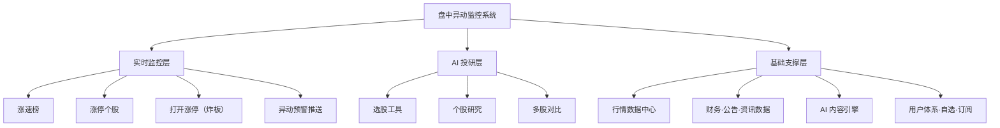
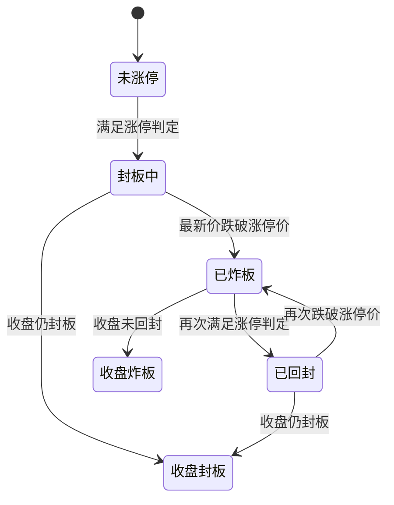

# 盘中异动监控系统产品需求文档（PRD）

> 原始需求（粗糙版）：`涨速榜、涨停个股、打开涨停`
> 本版本由产品部按资深股票软件产品经理视角补全为六大模块完整 PRD。
> V0.2（2026-09-11 评审确认版）：自用免费、命名"盘中异动监控系统"；数据供应商选型（免费方案）；业务参数确认；排期 AI 自动生成。

---

## 1. 文档信息

| 字段 | 内容 |
|---|---|
| 文档名称 | 盘中异动监控系统产品需求文档 |
| 版本号 | V0.2（评审确认版） |
| 编写人 | 产品部 |
| 编写日期 | 2026-09-11 |
| 状态 | 已评审（2026-09-11） |
| 适用范围 | 产品、设计、研发、测试 |

### 修订记录

| 版本 | 日期 | 修订说明 | 修订人 |
|---|---|---|---|
| V0.1 | 2026-09-11 | 基于原始需求（涨速榜、涨停个股、打开涨停）补全为六大模块完整 PRD | 产品部 |
| V0.2 | 2026-09-11 | 评审确认：自用免费、命名盘中异动监控系统；数据供应商选型（免费方案）；业务参数确认；排期 AI 自动生成 | 产品部 |

---

## 2. 产品概述

### 2.1 产品背景与问题

原始需求仅包含三个词条：**涨速榜、涨停个股、打开涨停**。三者属于"盘口监控 / 打板"场景，解决"谁在快速拉升、谁在涨停、谁炸板了"的即时信息问题，但作为完整产品存在明显缺口：

- **只有监控，没有决策**：用户看到涨停、炸板后，无法快速判断"为什么涨、值不值得关注"；
- **只有清单，没有研究**：缺少个股深度信息与横向比较能力，用户仍需跳转到第三方工具；
- **只有结果，没有解释**：选股与结论缺乏依据说明与来源追溯，用户无法信任结果。

本 PRD 在原始三个监控类需求基础上，补齐三大 AI 投研能力（**选股工具、个股研究、多股对比**），形成"监控发现 → AI 研究 → 对比决策"的完整链路。

> 📌 **2026-09-11 评审决策：**本产品为**个人自用工具**（非商业产品），命名"盘中异动监控系统"；全部功能**免费**，不设付费分层；行情数据源优先免费方案（详见数据需求章节选型表）；业务参数按行业惯例确认；版本排期由系统自动生成。

### 2.2 产品定位

本人自用的 A 股盘中异动监控与研究工具。以盘口实时性（打板 / 短线）与研究可解释性（中长线）为核心，覆盖"监控发现 → AI 研究 → 对比决策"的完整链路；免费自部署，数据源优先免费公开方案，不面向对外分发。

### 2.3 产品目标与成功指标

| 目标 | 可观测指标 | 口径与来源 | 检查频率 |
|---|---|---|---|
| 盘中异动识别准确 | 涨停 / 炸板 / 涨速榜识别与实盘一致率 ≥ 99% | 每日收盘后抽样与主流行情软件核对 | 日 |
| 预警及时 | 预警推送延迟 ≤ 5 秒达标率 ≥ 95% | 系统日志统计 | 日 |
| 研究高效 | 个股研究报告生成时长 P95 ≤ 60 秒 | 服务端日志 | 日 |
| 系统稳定 | 交易时段系统可用率 ≥ 99% | 运行监控 | 日 |

### 2.4 使用者画像（自用）

| 使用角色（本人） | 特征 | 核心诉求 |
|---|---|---|
| 短线盯盘 | 关注涨速异动、涨停、炸板与连板梯队，盘中高频使用 | 实时异动、涨停原因、炸板预警、情绪指标 |
| 波段 / 研究 | 关注板块轮动、个股基本面与横向比较 | 条件选股、个股深度研究、多股对比 |

### 2.5 产品原则（红线）

> ⚠️ **四条红线，全模块强制执行：**
> 1. 不提供确定性买卖建议：所有 AI 输出必须附带"仅供参考，不构成投资建议"声明；
> 2. 结论可追溯：AI 研究结论必须标注数据来源与证据分级，禁止黑盒评分与不可解释排名；
> 3. 行情口径透明：涨速、涨停、炸板等指标必须公示计算口径，交易所规则变更时同步更新并公告；
> 4. 风险可见：ST、退市风险、非标审计、重大诉讼、连续亏损、高估值等必须显性标记，不得默认隐藏或默认排除。

---

## 3. 名词与口径定义

| 名词 | 定义 |
|---|---|
| 涨速 | 每分钟平均涨幅速率（%），默认 5 分钟窗口，计算口径见业务规则章节 |
| 涨停 | 个股最新价达到当日涨停价且处于封板状态（含一字板） |
| 打开涨停（炸板） | 个股当日曾涨停，后跌破涨停价（开板）的事件 |
| 回封 | 炸板后再次封上涨停价 |
| 封单 | 涨停价买一档委托挂单量，用于衡量封板强度 |
| 连板 | 连续涨停的交易日数（含当日） |
| 炸板率 | 当日炸板家数 ÷（炸板家数 + 收盘封板家数） |
| 晋级率 | 昨日涨停股中今日继续涨停的比例 |
| 首板 / 高度板 | 首板：当日首次涨停；高度板：连板数较高的股票 |
| 情绪周期 | 由涨停家数、炸板率、连板高度等指标合成的市场情绪定性（冰点 / 修复 / 发酵 / 高潮 / 退潮） |
| 无涨跌幅限制 | 新股上市初期等不设价格涨跌幅限制的情形，不纳入涨停家数统计（单列展示） |

---

## 4. 用户画像与核心场景

| 编号 | 场景 | 涉及模块 |
|---|---|---|
| S1 | 早盘打板：9:30 开盘后打开涨速榜查看快速拉升个股，点击个股查看涨停原因解读，判断是否加入自选 | M1、M2 |
| S2 | 连板梯队复盘：午盘打开涨停个股页，按连板高度与封单强度识别市场高度板，查看板块涨停家数分布 | M2 |
| S3 | 炸板预警：自选股盘中炸板，App 推送预警，用户查看炸板时间线、回封状态与封单变化 | M3、M1 |
| S4 | 条件选股研究：按"储能 + 业绩预增 + 换手率区间"组合选股，系统输出候选池、入选理由与业务证据，用户对重点股生成个股研究报告 | M4、M5 |
| S5 | 多股对比决策：在两只候选股之间犹豫，生成横向对比报告（行情、财务、估值、商业模式、风险），辅助二选一 | M6 |

---

## 5. 产品范围

### 5.1 范围（六大模块）

| 编号 | 模块 | 类型 | 说明 |
|---|---|---|---|
| M1 | 涨速榜 | 实时监控 | 全市场涨速实时排行、筛选、异动标记 |
| M2 | 涨停个股 | 实时监控 | 涨停全景、连板梯队、封单强度、涨停原因 |
| M3 | 打开涨停 | 实时监控 | 炸板监控、回封状态、情绪指标、预警推送 |
| M4 | 选股工具 | AI 投研 | 多维度条件选股、主题 / 产业链选股、龙头识别、结果解释 |
| M5 | 个股研究 | AI 投研 | 个股速览卡与深度研究报告，证据分级、来源可审计 |
| M6 | 多股对比 | AI 投研 | 多股票横向对比报告，口径对齐、差异解释 |

### 5.2 非目标（V1 不做）

- 不做交易下单、模拟交易或券商导流开户（后续版本评估）；
- 不做 Level-2 十档行情（V1 使用 Level-1 行情与买卖一档即可满足需求）；
- 不做美股、港股、基金、期货（V1 仅 A 股沪深京）；
- 不做社交、社区与 UGC 内容；
- 不做自选云同步以外的多设备复杂协同。

### 5.3 优先级

| 优先级 | 模块 | 理由 |
|---|---|---|
| P0 | M1 涨速榜、M2 涨停个股、M3 打开涨停 | 原始需求，监控核心，先行交付 |
| P1 | M4 选股工具 | 承接监控到研究的中间环节，AI 能力基线之一 |
| P2 | M5 个股研究、M6 多股对比 | 深度能力，依赖 AI 内容质量与合规体系成熟 |

### 5.4 依赖与假设

- **依赖**：免费公开行情数据源（东财 / 腾讯 / 新浪公开接口、AKShare、Tushare 等）、财务与公告数据源、资讯 / 研报数据源、AI 内容服务（大模型 + 检索增强 + 内容审核）；
- **假设**：免费行情接口支持 1-3 秒级刷新（需实测确认频次与稳定性）；AI 报告生成延迟可控（个股研究 ≤ 60s）；AI 内容合规审核流程可通过。

---

## 6. 信息架构

| 模块 | 主要入口 | 核心能力 |
|---|---|---|
| M1 涨速榜 | 首页 Tab、监控页 | 涨速排行、阈值筛选、板块过滤、异动标记 |
| M2 涨停个股 | 首页 Tab、涨停专题 | 涨停全景、连板梯队、封单强度、涨停原因 |
| M3 打开涨停 | 首页 Tab、预警中心 | 炸板监控、回封状态、情绪指标、预警推送 |
| M4 选股工具 | 选股 Tab、个股页入口 | 条件选股、主题 / 产业链选股、龙头识别、结果解释 |
| M5 个股研究 | 个股详情页、研究报告入口 | 速览卡、深度报告、证据分级、导出分享 |
| M6 多股对比 | 对比 Tab、选股结果入口 | 多股横向对比、维度配置、报告生成、导出分享 |

---

## 7. 功能需求详述

### 7.1 M1 涨速榜

**功能概述**：实时计算并排序全市场个股涨幅速率，帮助用户快速发现正在快速拉升的股票，属于打板与波段用户的入口级功能。

**页面结构与字段**：

| 字段 | 说明 | 示例 |
|---|---|---|
| 代码 / 名称 | 股票标识 | 600519 贵州茅台 |
| 最新价 | 当前成交价 | 1888.00 |
| 涨速 % | 每分钟平均涨速 | 2.35 |
| 现涨幅 % | 当日累计涨幅 | 8.12 |
| 成交额 | 当日累计成交额 | 45.6 亿 |
| 换手率 % | 当日换手率 | 3.2 |
| 所属板块 | 概念 / 行业标签 | 白酒 |
| 状态标记 | 涨停中 / 炸板 / 创 N 日新高 / 异常波动 | 涨停中 |

**业务规则**：

- 刷新频率 1 秒（交易时段 9:30-11:30、13:00-15:00）；集合竞价时段 9:15-9:25 不展示涨速榜，展示竞价涨幅榜替代；
- 默认股票池：沪深京 A 股；排除停牌股、退市整理期股票、上市首日股票（无昨收参考价）；
- 排序：涨速降序，默认展示前 50 名，支持切换前 100 / 全部；
- 涨速阈值快捷档：≥ 0.5% / ≥ 1% / ≥ 2% / ≥ 3% / ≥ 5%，支持自定义阈值；
- 过滤条件：板块、自选股、是否涨停、是否 ST，条件可组合；
- 点击行进入个股详情页；支持一键加入自选。

**交互与状态**：

- 榜单状态：交易中（实时刷新）/ 午间休市（冻结 11:30 快照并提示）/ 收盘（冻结 15:00 快照，展示"已收盘"）；
- 一字板标记：开盘即封死涨停的个股涨速为 0，须标记"一字板"，不得与普通拉升混淆；
- 新股 / 次新（上市 ≤ 5 日无涨跌幅限制）：默认排除或单独分组标记。

**异常与边界**：

- 数据断流：展示最后成功快照时间并提示"行情延迟"，断流超过 3 秒触发提示；
- 单分钟涨速异常（如超 10%）：触发风控标记，仅展示事实数据，不展示为推荐；
- 临时停牌：从榜单剔除并记录。

**验收标准**：

- [ ] 交易时段榜单 1 秒内更新，断流超 3 秒展示延迟提示
- [ ] 涨速计算与口径文档一致（抽样 5 只股票人工复核通过）
- [ ] 所有筛选 / 过滤条件可组合使用，结果 1 秒内返回
- [ ] 一字板、新股、ST 标记规则与文档一致

### 7.2 M2 涨停个股

**功能概述**：全市场涨停个股全景监控，含涨停时间、封单强度、连板梯队与 AI 涨停原因，是打板用户的核心工具。

**页面结构与字段**：

| 字段 | 说明 |
|---|---|
| 代码 / 名称 | 股票标识 |
| 最新价 / 涨停价 | 当前价与当日涨停价 |
| 涨幅 % | 当日累计涨幅 |
| 首次封板时间 | 当日首次涨停时刻 |
| 最后封板时间 | 最近一次涨停时刻 |
| 开板次数 | 当日炸板次数累计 |
| 连板数 | 连续涨停天数 |
| 封单金额 | 买一挂单量 × 涨停价 |
| 封单 / 流通市值 | 封板强度核心指标 |
| 成交额 / 换手率 | 当日活跃度 |
| 涨停原因 | AI 生成原因标签（如"AI 算力""中报预增"）+ 50 字以内解释 |
| 板块 / 流通市值 | 归类与体量 |
| 状态 | 封板中 / 已炸板 / 已回封 |

**业务规则**：

- 涨停判定与涨停价计算见业务规则章节；
- 默认排序：连板数降序 + 封单金额降序；支持按封板时间、封成比、换手率切换排序；
- 涨停原因由 AI 基于公告、资讯、板块联动生成 1-3 个标签，必须可点击溯源到原文；
- 页头展示：涨停家数、炸板家数、炸板率、连板高度、晋级率等情绪指标；
- 连板股展示"连板日历"（近 N 个交易日涨停记录）；
- ST 涨停股单独分组展示。

**交互与状态**：

- 涨停全景：当日曾涨停的全部个股；连板梯队：按连板数分组（首板 / 2 板 / 3 板…最高板）；
- 点击行进入个股详情页；涨停原因标签点击后弹出原因卡片（标签 + 解释 + 来源链接）。

**异常与边界**：

- 无涨跌幅限制个股（新股前 5 日等）：单独标记"无涨跌幅限制"，不纳入涨停家数统计；
- 14:50 后尾盘封板标记"尾盘板"，强度相对弱；
- 反复炸板个股展示开板次数与炸板时间线（≥ 3 次折叠展示）。

**验收标准**：

- [ ] 涨停家数与交易所 / 主流行情软件当日数据一致（抽样核对 3 个交易日）
- [ ] 连板数跨交易日计算正确（含节假日前后连续交易日场景）
- [ ] 涨停原因标签可点击溯源至原文
- [ ] 排序与筛选规则与文档一致

### 7.3 M3 打开涨停（炸板监控）

**功能概述**：监控当日"曾涨停后开板"的股票，输出炸板时间线、回封状态与炸板率，用于判断市场情绪与承接强度，辅助打板与风控决策。

**页面结构与字段**：

| 字段 | 说明 |
|---|---|
| 代码 / 名称 | 股票标识 |
| 当前涨幅 % | 炸板后最新涨幅 |
| 首次封板时间 | 当日首次涨停时刻 |
| 炸板时间 | 最近一次开板时刻 |
| 炸板次数 | 开板次数累计 |
| 当前状态 | 已炸板 / 已回封 / 封板中 |
| 炸板前封单 | 开板前封单金额 |
| 封单变化 | 炸板前后封单金额变化 |
| 距涨停价 | 当前价距涨停价的差幅 |
| 板块 | 所属板块 |

**业务规则**：

- 炸板判定与状态机见业务规则章节；
- 页头展示情绪指标：炸板家数、炸板率、封板率；
- 支持按板块统计炸板率，识别弱势板块；
- 排序：炸板时间倒序 / 炸板次数倒序。

**交互与状态**：

- 炸板预警推送（P1）：自选股炸板时推送通知，延迟 ≤ 5 秒，支持在设置中关闭；
- 多次炸板展示完整时间线（封板 → 炸板 → 回封 → 再炸板）。

**异常与边界**：

- 收盘后状态冻结为"收盘封板 / 收盘炸板"；
- 盘中临时停牌期间不计算状态迁移。

**验收标准**：

- [ ] 炸板事件识别延迟 ≤ 3 秒
- [ ] 炸板率口径与业务规则章节一致且可复算
- [ ] 预警推送延迟 ≤ 5 秒且可关闭
- [ ] 状态机迁移正确（封板 → 炸板 → 回封 → 再炸板）

### 7.4 M4 选股工具

**功能概述**：多维度智能选股：基于行情、估值、财务、技术、主题概念、产业链与策略风格条件组合，输出可解释、可追溯的候选股分层结果。能力基线参照"股票筛选"标准（市场 → 行业 / 主题 / 产业链 → 指标 / 策略 → 候选池 → 业务证据验证 → 分组排序）。

**核心功能**：

- **条件选股**：指标条件编辑器，支持行业、概念、PE / PB、ROE、营收 / 利润增速、换手率、成交额、涨跌幅、市值、股息率、技术指标等条件组合；
- **主题 / 产业链选股**：从主题概念或产业链环节出发召回候选，并验证业务关联；
- **龙头识别**：对选定主题 / 行业识别产业龙头、业务龙头、市值龙头、交易龙头四类；
- **结果解释**：每个候选股输出入选理由、业务证据与来源链接；
- **候选分层**：核心候选 / 重要参与者 / 观察名单 / 待验证；
- **保存与导出**：保存筛选策略、导出 Excel / CSV。

**业务规则**：

- 股票池来源必须可追溯：指数成分、概念标签、产业链映射、公告 / 研报线索、条件筛选结果，禁止来历不明名单；
- 禁止黑盒评分与隐藏加权排名；排序与分组依据必须透明可解释；
- 概念标签仅用于候选召回，核心候选必须附业务证据（公告 / 定期报告 / 互动平台 / 官网 / 权威媒体）；
- 风险标记：ST、退市风险、非标审计、重大诉讼、连续亏损显性标记，按用户目标决定排除、保留或移入观察名单；
- 不输出"买入 / 卖出 / 必涨"等确定性建议。

**异常与边界**：

- 条件组合结果为空：提示放宽建议（如降低阈值、扩大板块范围）；
- 字段数据缺失：标记"无数据"并说明，不补造；
- 结果过多（> 200 只）：提示追加过滤条件或分批导出。

**验收标准**：

- [ ] 筛选结果全部可追溯来源，无来历不明候选
- [ ] 排序 / 分组规则可解释且无隐藏评分
- [ ] 核心候选均附带业务证据与来源
- [ ] 导出文件字段与页面展示一致

### 7.5 M5 个股研究

**功能概述**：输入个股生成可审计的研究报告：一页纸速览卡 + 深度研究报告（商业模式、竞争优势、财务质量、估值框架、最强反方与证伪信号）。能力基线参照"上市公司基本面研究"标准（身份核验、来源标记、可审计摘要、分档表、假设卡）。

**核心功能**：

- **个股速览卡**：公司身份、最新行情、核心财务、估值位置、风险标签一屏呈现；
- **深度报告**：商业模式 → 竞争优势 → 财务质量 → 估值框架 → 最强反方 → 证伪信号；
- **证据分级**：一手（公告 / 定期报告 / 交易所）、结构化数据库、二手（媒体 / 研报）逐条标注来源与日期；
- **可审计摘要**：直接结论、最强证据、最大未知、证据强度、推翻信号五要素；
- **生成与分享**：生成报告、导出 PDF / 长图、分享链接。

**业务规则**：

- 主体身份核验：生成前先核验公司上市 / 退市 / 更名状态，禁止基于过期身份生成结论；
- 关键数字逐条标注来源、报告期、单位与币种；
- 无一手来源的量级数据放入"假设卡"，摘要与结论段不得引用；
- 关键输入缺失时输出分档表（以未知量为自变量），不假设数值；
- 估值只给条件式框架，不给单点目标价；不输出买卖建议。

**异常与边界**：

- 报告生成超时（> 90 秒）：提示重试或降级为速览卡；
- 公司无近期公告 / 财报：报告标注数据截止时间并降低结论强度；
- AI 服务不可用：降级展示速览卡（结构化数据），不展示空白报告。

**验收标准**：

- [ ] 报告包含速览卡与六大分析模块（商业模式 / 竞争 / 财务 / 估值 / 反方 / 证伪）
- [ ] 所有精确数字带来源标记与日期
- [ ] 摘要段仅引用一手或数据库级证据
- [ ] 全文含免责声明，无确定性买卖建议
- [ ] 报告生成时长 P95 ≤ 60 秒

### 7.6 M6 多股对比

**功能概述**：2-5 只股票横向对比，覆盖行情表现、财务质量、估值、商业模式、成长性与风险，输出结构化对比报告。能力基线参照"多股票横向研究"标准（口径对齐、核心财务快照、差异机制、可比性审计）。

**核心功能**：

- **添加对比标的**：2-5 只，支持自选、搜索、从选股结果带入；
- **对比维度**：行情与阶段涨跌、核心财务快照、估值、商业模式、成长性、风险催化剂；
- **对比报告**：逐维度并排对比 + 差异解释 + 因果主线结论；
- **走势图**：同窗口、同频率、同复权定义的 K 线 / 走势对比；
- **导出**：PDF / 长图 / 分享链接。

**业务规则**：

- 数据口径对齐：统一估值日、报告期、币种、单位与业务层级；口径不一致时明确标注不可比，不强行排名或拼凑区间；
- 每个维度必须同时讨论全部对比标的，解释差异原因与含义；
- 结论给出"本质差异是什么、为什么重要"，不给买卖指令与目标价；
- 报告末行固定声明：公开资料仅供信息参考，不构成投资建议。

**异常与边界**：

- 停牌 / 退市标的：标记并提示；
- 跨市场对比（A / H）：标注折溢价、交易时间与交易制度差异；
- 数据缺失：逐项标注，不补造。

**验收标准**：

- [ ] 2-5 只股票对比可完整生成
- [ ] 报告包含核心财务快照表（同一估值日与报告期）
- [ ] 所有比较口径一致或明确标注不可比
- [ ] 报告生成时长 P95 ≤ 90 秒

---

## 8. 业务规则与计算口径

### 8.1 涨跌幅限制规则

| 板块 / 情形 | 涨跌幅限制 | 说明 |
|---|---|---|
| 沪深主板（非 ST） | ±10% | 主板常规 |
| 创业板 | ±20% | 注册制 |
| 科创板 | ±20% | 注册制 |
| 北交所 | ±30% | 北交所常规 |
| 沪深主板 ST / *ST | ±5% | 风险警示 |
| 创业板 / 科创板 ST | ±20% | 注册制下不另行降低 |
| 新股上市首日（主板） | 上限 44% | 集合竞价 20% + 连续竞价 20% 叠加口径 |
| 科创板 / 创业板新股 | 前 5 个交易日无限制 | 之后恢复 ±20% |
| 北交所新股 | 上市首日无限制 | 之后恢复 ±30% |

> 📌 以上以交易所现行规则为基准，规则变更时须配置化更新并公示；无涨跌幅限制个股不纳入涨停家数统计，单列展示。

### 8.2 涨速计算口径

- 涨速（%/分钟）=（最新价 − T−N 分钟参考价）÷ T−N 分钟参考价 × 100% ÷ N；
- 默认窗口 N = 5 分钟（已确认 2026-09-11），提供 1 / 3 / 5 / 10 分钟切换；
- T−N 分钟参考价取该时点最后成交价快照；无成交则取最近有效成交价；
- 仅交易时段 9:30-11:30、13:00-15:00 计算；开盘首分钟（9:30-9:31）数据波动大，允许标记"开盘初期"；
- 集合竞价时段不计算涨速，涨速榜页头展示竞价涨幅榜替代。

### 8.3 涨停价与涨停判定

- 涨停价 = round（昨收 ×（1 + 该股涨跌幅限制比例），2），四舍五入到 0.01 元；
- 涨停判定（同时满足）：最新价 ≥ 涨停价 − 0.001 元容差；买一档存在大额封单（封单金额 ≥ 100 万元，已确认 2026-09-11）；最近成交价未跌破涨停价；
- 一字板：开盘价即涨停价且持续封板，单独标记。

### 8.4 打开涨停判定与状态机

- 打开涨停事件：状态由"封板中"迁移为最新价 < 涨停价 − 0.001 元容差；
- 回封事件：炸板后再次满足涨停判定；
- 炸板次数 = 当日开板次数累计；
- 收盘状态冻结：收盘时封板 → "收盘封板"；收盘时未回封 → "收盘炸板"。

### 8.5 连板计算

- 连板数 = 截至当日连续涨停的交易日数（含当日）；
- 从当日向前回溯，遇到第一个未涨停交易日停止计数；
- 当日盘中未收盘：涨停中展示"潜在 N 连板"，收盘后固化；
- 除权除息日、停牌日不中断连板计数（以实际交易日序列为准）。

### 8.6 封单强度

- 封单金额 = 涨停价 × 买一档委托量；
- 封单 / 流通市值 = 封单金额 ÷ 流通市值 × 100%；
- 封成比 = 封单金额 ÷ 当日成交额；
- 强度分级（口径公开）：强（封单 / 流通市值 ≥ 2%）、中（0.5% - 2%）、弱（< 0.5%）（阈值已确认 2026-09-11）。

### 8.7 市场情绪指标

- 涨停家数：当日收盘封板家数（曾涨停家数单列）；
- 炸板家数：当日打开过涨停的家数；
- 炸板率 = 炸板家数 ÷（炸板家数 + 收盘封板家数）× 100%；
- 封板率 = 1 − 炸板率；
- 晋级率 = 昨日涨停股中今日继续涨停的比例；
- 连板高度 = 当日最高连板数；
- 情绪定性（冰点 / 修复 / 发酵 / 高潮 / 退潮）由上述指标组合推导，规则公开并随版本迭代。

---

## 9. AI 能力需求

### 9.1 AI 能力总览

| 能力 | 输入 | 输出 | 归属模块 |
|---|---|---|---|
| 涨停原因解读 | 个股 + 当日行情 + 公告 / 资讯 / 板块联动 | 1-3 个原因标签 + 50 字以内解释 + 来源链接 | M2 |
| 选股逻辑解释 | 筛选条件 + 候选股 + 业务证据 | 候选分层 + 入选理由 + 证据分级与来源 | M4 |
| 个股研究报告 | 股票代码 / 名称 + 关注点 | 速览卡 + 深度报告（六模块） | M5 |
| 多股对比报告 | 2-5 只股票 + 对比维度 | 横向对比报告 + 差异解释 | M6 |

### 9.2 涨停原因解读

- 禁止无依据归因：原因必须关联可检索证据（公告、定期报告、互动平台、权威媒体、板块联动数据）；
- 同一事件多解释时展示主因与次因，不得只输出单一年度 / 单一来源结论；
- 原因标签可点击溯源，来源失效时标注"来源不可用"。

### 9.3 选股逻辑解释与结果分层

- 每个候选股输出入选理由、证据分级（一手 / 数据库 / 二手）与来源；
- 概念标签仅用于召回，核心候选必须附业务证据；
- 排序依据透明展示（按哪个指标、哪个口径），禁止隐藏权重与黑盒评分。

### 9.4 个股研究报告生成

- 生成前主体身份核验（上市 / 退市 / 更名 / 代码变更）；
- 精确数字逐条标注来源标记与报告期；
- 摘要段仅引用一手或数据库级证据；
- 估值输出条件式分档框架，不输出单点目标价。

### 9.5 多股对比报告生成

- 统一估值日、报告期、币种与单位后比较；
- 每个维度同时讨论全部标的并解释差异；
- K 线 / 走势图同窗口同复权，不得用收盘价伪造 OHLC。

### 9.6 AI 内容合规与质量要求

- 全部 AI 内容必须附带"仅供参考，不构成投资建议"声明；
- 证据分级展示，禁止确定性买卖表述（买入 / 卖出 / 必涨）；
- 涉及公司负面信息（财务造假、处罚、问询）标注来源与日期；
- 上线前通过合规审核；敏感内容（重组、业绩预增等）二次校验；
- 质量门槛：报告生成成功率 ≥ 99%；可核验字段事实性错误率 < 1%（抽样质检）；生成延迟见各模块验收标准。

### 9.7 AI 能力验收标准

- [ ] 四项 AI 能力均通过合规审核流程
- [ ] AI 输出中的可核验字段抽样错误率 < 1%
- [ ] 全部 AI 输出含免责声明且无确定性买卖建议
- [ ] 涨停原因、入选理由、报告结论均可溯源到来源

---

## 10. 数据需求

### 10.1 数据源总览

| 数据类别 | 内容 | 来源类型 | 时效要求 |
|---|---|---|---|
| 实时行情 | 最新价、五档、成交额、换手率、涨跌幅 | 免费公开行情接口（东财 / 腾讯 / 新浪等） | 1-3 秒 |
| K 线数据 | 日线、分钟线、复权因子 | 行情服务商 | 收盘后 T+0 更新 |
| 财务数据 | 三张报表、财务指标、分红 | 财务数据服务商 | 财报披露后更新 |
| 公告数据 | 公告原文、交易所问询与回复 | 交易所 / 数据服务商 | 实时 |
| 资讯 / 研报 | 新闻、研报摘要、互动平台问答 | 资讯服务商 | 实时 |
| 主题 / 产业链 | 概念标签、产业链图谱、成分股映射 | 数据服务商 / 自建 | 季度更新 + 事件驱动 |

### 10.2 数据供应商选型（2026-09-11 评审确认，免费优先）

| 供应商 / 方案 | 费用 | 覆盖数据 | 在本系统中的用途 | 风险 / 限制 |
|---|---|---|---|---|
| 东方财富公开行情接口（push2 / push2delay 系列） | 免费，无需 Key | 沪深京全 A 实时快照、五档盘口、涨停池、资金流、板块行情 | 主行情源：涨速榜 1 秒轮询、涨停 / 炸板判定、封单强度、情绪指标 | 非官方接口，可能变更 / 限流；需重试与熔断 |
| 腾讯财经 / 新浪财经公开接口（qt.gtimg.cn / hq.sinajs.cn） | 免费 | 秒级实时行情、五档盘口 | 备用行情源：主源异常自动切换；涨速双源校验 | 非官方、无正式文档，字段需自解析 |
| AKShare（开源免费库） | 免费开源 | 实时行情、涨停板、龙虎榜、板块概念、财务、研报资讯（封装东财 / 新浪等） | 数据聚合层：涨停池、板块概念、财务与公告聚合，供选股与个股研究 | 爬虫封装，上游接口变动影响；依赖社区维护 |
| Tushare Pro（免费积分制） | 免费（120 基础积分，约 50 次 / 分钟，日 8 千次） | 日线、股票列表、财务指标；三表与业绩预告需 2000 积分 | 结构化历史与财务数据：选股财务条件、个股研究财务质量 | 免费档频次受限；财务深度数据需积分升级（约 200 元 / 年） |
| mootdx（开源免费，通达信 TCP 协议） | 免费 | 实时行情、五档、K 线 | 低封禁风险的行情备源 | 协议非公开，依赖第三方实现 |

> ⚠️ **使用提示**：东财 / 腾讯 / 新浪公开接口为非官方方案，接口可能变更或限流，需实现失败重试、熔断与多源自动切换；Tushare 免费档有频次限制（约 50 次 / 分钟），财务深度数据需积分升级；本方案仅适用于个人自用场景，对外分发或商用前须重新评估数据授权。

### 10.3 行情数据要求

- 时间戳精度到秒，行情快照与交易所标准一致；
- 涨速榜 1 秒刷新需要行情推送或高频轮询能力支撑；
- 数据断流 / 延迟需有监控与用户提示机制。

### 10.4 AI 内容数据要求

- 检索增强数据源：公告、定期报告、互动平台、官网、研报、权威媒体；
- 数据源更新时间与 AI 生成时间之间的时滞需在报告中标注（报告生成时间）；
- 二手来源（自媒体、论坛）仅作低权重线索，不作结论依据。

### 10.5 用户数据与隐私

- 自选股、筛选策略、报告历史仅用户本人可见；
- 遵循个人信息保护法：最小化采集、加密传输、明确留存期限、提供删除入口。

---

## 11. 非功能需求

### 11.1 性能要求

| 指标 | 要求 |
|---|---|
| 涨速榜刷新频率 | 1 秒 |
| 涨停 / 炸板列表刷新频率 | 3 秒 |
| 首屏加载 | ≤ 2 秒（弱网 ≤ 4 秒） |
| 列表操作响应 | ≤ 1 秒 |
| 并发能力 | 自用场景下榜单查询 P95 ≤ 500ms |
| 预警推送延迟 | ≤ 5 秒 |
| 个股研究报告生成 | P95 ≤ 60 秒 |
| 多股对比报告生成 | P95 ≤ 90 秒 |

### 11.2 可靠性要求

- 行情断流提示与自动恢复；
- AI 服务降级：主服务不可用时个股页降级为速览卡，不展示空白；
- 核心服务监控告警：行情延迟、AI 生成失败率、推送到达率。

### 11.3 安全与合规

- 行情数据合规：使用免费公开数据源，规避版权与授权风险；接口变更 / 限流需熔断与多源切换，个人自用场景下评估各接口使用条款；
- 内容合规：AI 输出审核、免责声明、敏感信息过滤；
- 用户隐私：最小化采集、加密传输、留存期限明确；
- 未成年人保护：不向未成年人提供投资建议类内容。

### 11.4 兼容性

- iOS 12+、Android 8+；鸿蒙适配列入 P2。

---

## 12. 埋点与指标体系

### 12.1 系统运行与质量指标

| 指标 | 口径 | 来源 | 检查频率 |
|---|---|---|---|
| 监控识别准确率 | 涨停 / 炸板 / 涨速榜识别与实盘一致率 ≥ 99% | 每日收盘抽样核对 | 日 |
| 预警达标率 | 推送延迟 ≤ 5 秒的预警占比 ≥ 95% | 系统日志 | 日 |
| 报告生成成功率 | 个股研究 + 对比报告生成成功占比 ≥ 99% | 服务端日志 | 日 |
| 数据源切换次数 | 主行情源异常触发备源切换次数 | 运行监控 | 日 |
| 系统可用率 | 交易时段服务可用时长占比 ≥ 99% | 运行监控 | 日 |

### 12.2 关键埋点清单

- 榜单曝光 / 点击（涨速榜、涨停全景、连板梯队、炸板列表）；
- 筛选与过滤条件使用分布；
- 涨停原因标签点击与溯源；
- 选股条件组合、候选分层结果、导出行为；
- 报告生成时长、生成成功率、导出 / 分享次数。

---

## 13. 里程碑与排期

| 版本 | 范围 | 排期（2026-09-11 AI 自动生成） |
|---|---|---|
| V1.0 | M1 涨速榜 + M2 涨停个股 + M3 打开涨停 + 自选 / 预警基础 | 2026-09-14 ~ 2026-10-25（6 周） |
| V1.1 | M4 选股工具 + AI 内容合规体系 | 2026-10-26 ~ 2026-11-29（5 周） |
| V2.0 | M5 个股研究 + M6 多股对比 + 鸿蒙适配 | 2026-11-30 ~ 2027-01-17（7 周） |

---

## 14. 风险与开放问题

### 14.1 风险清单

| 风险 | 影响 | 应对 |
|---|---|---|
| 免费公开行情接口稳定性（接口变更 / 限流 / 封 IP / 无 SLA） | 高 | 多源冗余：东财主源 + 腾讯 / 新浪备源自动切换，失败重试与熔断；个人自用场景风险可控，对外分发或商用前重新评估数据授权 |
| AI 内容合规风险（涉荐股嫌疑） | 高 | 合规审核流程、免责声明、禁止确定性建议 |
| AI 事实性错误 | 中高 | 证据分级、来源标注、抽样质检、错误率门禁 |
| 实时性能瓶颈 | 中 | 压测、缓存、降级方案、监控告警 |
| 交易所规则变更 | 中 | 口径配置化、变更公告与灰度 |

### 14.2 开放问题（已评审确认）

| 编号 | 问题 | 评审决策（2026-09-11） | 状态 |
|---|---|---|---|
| Q1 | 产品名称与品牌定位 | 自用产品，命名"盘中异动监控系统"，不做商业定位 | 已闭环 |
| Q2 | 免费 / 付费分层 | 全部免费，不设付费分层 | 已闭环 |
| Q3 | 行情数据供应商选型 | 免费方案：东财公开接口（主）+ 腾讯 / 新浪（备）+ AKShare + Tushare Pro + mootdx，详见数据需求章节选型表 | 已闭环，接口稳定性待实测 |
| Q4 | 业务参数 | 涨速默认窗口 5 分钟、涨停封单金额阈值 100 万元、封单强度分级强 ≥ 2% / 中 0.5%-2% / 弱 < 0.5%，已写入业务规则章节 | 已闭环 |
| Q5 | 版本排期与资源投入 | 排期由 AI 自动生成：V1.0（09-14 ~ 10-25）、V1.1（10-26 ~ 11-29）、V2.0（11-30 ~ 2027-01-17） | 已闭环 |

> 📌 **遗留待办**：1）免费数据接口连通性与频次实测（1 周内）；2）五档盘口字段与涨停池数据口径核对；3）业务参数上线后按实盘表现微调。

---

## 15. 总体验收标准

### 15.1 发布准入条件

- [ ] P0 三模块（M1 / M2 / M3）功能与口径验收通过（对照第 7、8 章验收标准）
- [ ] AI 内容合规审核通过
- [ ] 性能指标达标（对照非功能需求章节）
- [ ] 无 P0 / P1 级缺陷
- [ ] 埋点上线并验证数据正确性

### 15.2 验收流程

功能验收 → 口径复核（行情抽样与主流软件对比）→ 性能压测 → 合规评审 → 灰度发布（5% 用户）→ 全量发布。

> 📌 本 PRD 已于 2026-09-11 评审确认（自用免费、命名盘中异动监控系统）；遗留待办为免费数据接口实测与参数微调，完成后即可进入研发排期。
